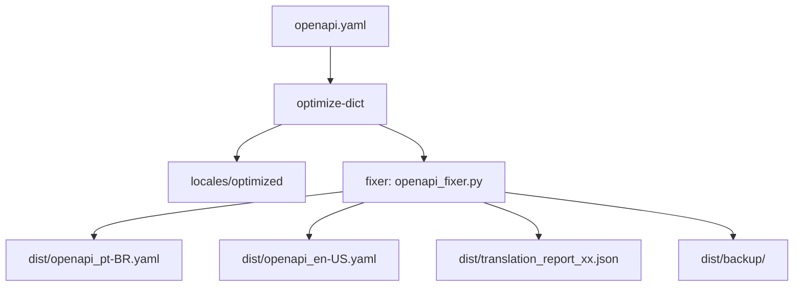

# OpenAPI Tools

A suite of command-line tools designed to lint, organize, and optimize OpenAPI specification files within the `api-docs-involves-stage` monorepo.


---

## 🎯 Overview

This project, located at `apps/openapi-tools`, provides a robust, automated workflow for maintaining our OpenAPI documentation. Its primary function is to process original OpenAPI JSON files, apply a series of language-specific optimizations, and prepare them for our documentation platform located in `apps/docs/apis`.

The main tool, `optimize-dict`, is a configuration-driven optimizer that makes API descriptions concise, consistent, and developer-friendly.

---

## 📈 Workflow Diagram

<details>
<summary>Click to expand the project workflow diagram</summary>



</details>

---

## 🚀 Quick Start

Get up and running in 5 minutes. These commands are for **macOS and Linux**.

```bash
# 1. Navigate to the tool's directory from the monorepo root
cd apps/openapi-tools

# 2. Create and activate a Python virtual environment
python3 -m venv .venv
source .venv/bin/activate

# 3. Install the project and all development dependencies
pip install -e ".[dev]"

# 4. Run the optimizer for all languages
optimize-dict --all
```

---

## 🧰 Detailed Usage

The primary entry point is the `optimize-dict` command.

| Command               | Description                                                                            |
| :-------------------- | :------------------------------------------------------------------------------------- |
| `optimize-dict`       | Runs in **interactive mode**, prompting you to select a language.                      |
| `optimize-dict --pt`  | Optimizes all files for Portuguese (`pt-BR`).                                          |
| `optimize-dict --en`  | Optimizes all files for English (`en-US`).                                             |
| `optimize-dict --es`  | Optimizes all files for Spanish (`es-ES`).                                             |
| `optimize-dict --fr`  | Optimizes all files for French (`fr-FR`).                                              |
| `optimize-dict --all` | **Ideal for automation.** Runs the optimizer for all supported languages sequentially. |

---

## 🌍 OpenAPI Fixer & Translator

**`openapi_fixer.py`** is an advanced CLI tool that automates the process of fixing, translating, and validating your OpenAPI specification across multiple languages. It leverages your translation dictionaries to produce ready-to-publish OpenAPI files for international documentation.

### Features

* Reads a base OpenAPI file with translation keys (e.g., `api.doc.general.title`).
* Substitutes all translation keys using language-specific dictionaries from `locales/optimized/`.
* Ensures required OpenAPI fields (`info`, `contact`, etc.) are present and filled.
* Outputs fully translated and validated OpenAPI specs for each language.
* Generates detailed reports for missing translations and process stats.
* Creates automatic backups of the original file.

### How to Run

```bash
# 1. From the monorepo root, activate your virtual environment
cd apps/openapi-tools
source .venv/bin/activate

# 2. Run the fixer for all available languages (auto-detects dictionaries)
python src/openapi-tools/fixer/openapi_fixer.py

# 3. [Optional] Specify languages, input/output, or skip backup
python src/openapi-tools/fixer/openapi_fixer.py -l pt-BR en-US --no-backup
```

#### Key CLI Options

| Option                 | Description                              | Example                |
| ---------------------- | ---------------------------------------- | ---------------------- |
| `-l`, `--languages`    | Process only specific languages          | `-l pt-BR en-US`       |
| `-i`, `--input`        | Set custom OpenAPI input file path       | `-i openapi.yaml`      |
| `-d`, `--dictionaries` | Use a different dictionaries directory   | `-d locales/optimized` |
| `-o`, `--output`       | Specify output directory                 | `-o dist/`             |
| `--no-backup`          | Skip backup of the original OpenAPI file | `--no-backup`          |
| `-v`, `--verbose`      | Enable verbose logging                   | `-v`                   |

#### Output

* Translated OpenAPI specs: `dist/openapi_<LANG>.yaml`
* Translation reports: `dist/translation_report_<LANG>.json`
* Original file backups: `dist/backup/openapi_original_<TIMESTAMP>.yaml`

---

## 🔧 Configuration & Extensibility

The tool is designed to be easily configured without changing the core Python code.

### Modifying Rules

All optimization rules are located in the `rules/` directory. To modify a rule, simply edit the relevant JSON file (e.g., `rules/en-US.json`).

The JSON structure includes:

* `field_patterns`: Simple text replacements for specific field types (e.g., `id`, `name`).
* `redundant_phrases`: Regex patterns to find and remove verbose text.
* `term_mappings`: A dictionary for replacing specific words or phrases.
* `formatting_patterns`: Regex for structural text formatting.
* `contractions`: Language-specific rules for contracting words (e.g., `de a` -> `da` in Portuguese).

### Adding a New Language

1. **Create Rule File**: In the `rules/` directory, create a new JSON file named after the language code (e.g., `de-DE.json`). Use `en-US.json` as a template.
2. **Translate Rules**: Populate the new file with rules for the target language.
3. **Update Script**: Open `scripts/workflow_manager.py` and add the new language code to the `SUPPORTED_LANGUAGES` list.
4. **Add CLI Flag (Optional)**: To add a new flag (e.g., `--de`), edit the `main()` function in `workflow_manager.py` and add a new `parser.add_argument`.

---

## 💻 Development & Contribution

Follow these guidelines to contribute to the project while maintaining code quality and consistency.

### 1. Code Style & Formatting

We use **Black** for uncompromising code formatting and **Ruff** for high-performance linting.

> **Important**: Before committing any changes, run the formatter and linter to ensure your code adheres to the project's style.

```bash
# Ensure your virtual environment is active

# Auto-format all Python files in the 'scripts/' directory
black scripts/

# Check for linting errors with Ruff
ruff check scripts/
```

### 2. Running Tests

We use **pytest** for testing.

```bash
# Ensure your virtual environment is active

# Run the entire test suite with verbose output
pytest -v
```

Tests are located in the `tests/` directory and should follow the `test_*.py` naming convention. `pytest` will discover and run them automatically.

### 3. Contribution Workflow

1. Create a new branch for your feature or bug fix.
2. Make your changes.
3. Format and lint your code (`black .` and `ruff check .`).
4. Write or update tests for your changes in the `tests/` directory.
5. Ensure all tests pass (`pytest -v`).
6. Submit a Pull Request for review.

> **Branch naming:**
> Use sempre o padrão `feat/<feature>`, `fix/<bug>`, ou `chore/<update>`.

> **Commit messages:**
> Prefira o padrão semântico:
> `feat:`, `fix:`, `chore:`, `docs:`, `refactor:`, etc.

---

## 🏗️ Project Structure

```
apps/openapi-tools/
├── locales/                # Input/Output directories for OpenAPI files
│   ├── original/
│   └── optimized/
├── rules/                  # Directory for language-specific rule files
│   ├── en-US.json
│   └── pt-BR.json
├── scripts/                # Main application source code
│   ├── api_dictionary_optimizer.py
│   ├── constants.py
│   └── workflow_manager.py
├── fixer/                  # OpenAPI fixer & translator (multi-language output)
│   ├── openapi_fixer.py
│   └── openapi_fixer_config.yaml
├── tests/                  # Directory for all tests
│   └── test_optimizer.py
├── .venv/                  # Python virtual environment (ignored by Git)
├── pyproject.toml          # Project definition and dependency management
└── README.md               # This file
```

---

## 🛠️ Troubleshooting

* **ModuleNotFoundError**
  Certifique-se de que o virtualenv está ativado antes de rodar os scripts (`source .venv/bin/activate`).

* **Permission denied**
  Verifique permissões na pasta `dist/` ou rode o comando como um usuário com permissão adequada.

* **Missing translations**
  Veja os relatórios em `dist/translation_report_xx.json` para detalhes de chaves faltantes.

* **Encoding errors**
  Garanta que todos os arquivos estão em UTF-8 e use sempre o parâmetro `encoding='utf-8'` nas aberturas de arquivos Python.

---

## 📊 Demo Output

### Before (input)

```yaml
info:
  title: api.doc.general.title
  description: api.doc.general.description
  version: 1.0.0
  contact:
    name: api.doc.general.contact.name
    email: api.doc.general.contact.email
```

### After (output - pt-BR)

```yaml
info:
  title: API Involves Stage
  description: API oficial para integração com o Involves Stage.
  version: 1.0.0
  contact:
    name: Suporte Involves
    email: suporte@involves.com
```

---

## 🔗 References

* [OpenAPI Specification](https://swagger.io/specification/)
* [Black - Python code formatter](https://black.readthedocs.io/en/stable/)
* [Ruff - Python linter](https://docs.astral.sh/ruff/)
* [Pytest - Python testing tool](https://docs.pytest.org/en/latest/)
* [Awesome OpenAPI](https://github.com/APIs-guru/awesome-openapi3)
* [Semantic Commit Messages](https://www.conventionalcommits.org/en/v1.0.0/)

---
